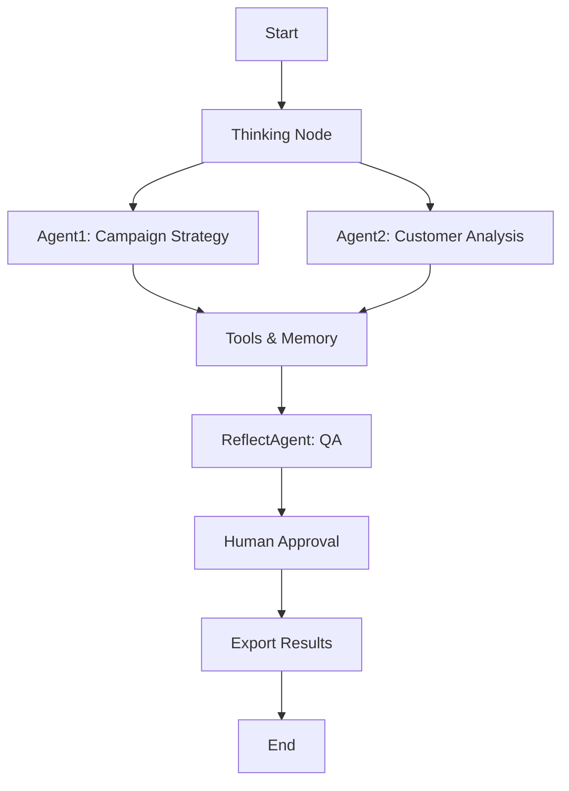

# 🚀 INitro Multi-Agent System

[](https://python.org)
[](https://flask.palletsprojects.com/)
[](https://langchain.com)
[](https://langchain-ai.github.io/langgraph/)
[](https://opensource.org/licenses/MIT)
[](https://github.com/RPI-GROUP-AI-Lab/ai-poc-iNitro-iNitroAgenticDecisioning/issues)
[](https://github.com/RPI-GROUP-AI-Lab/ai-poc-iNitro-iNitroAgenticDecisioning/stargazers)

> **Developed by [RPI-GROUP-AI-Lab](https://github.com/RPI-GROUP-AI-Lab)** - Advancing AI research and practical applications through innovative multi-agent systems.

A sophisticated multi-agent system powered by LangChain and LangGraph, featuring intelligent campaign optimization, real-time collaboration, and advanced AI-driven decision making. This project represents a proof-of-concept for agentic decisioning systems in enterprise environments.

## 🌟 Features

### 🤖 Multi-Agent Architecture
- **Agent1**: Campaign strategy and goal optimization
- **Agent2**: Customer analysis and targeting
- **ReflectAgent**: Quality assurance and reflection
- **ThinkingLayer**: LangChain-powered central coordination

### 🌐 Web Interface
- **Interactive Dashboard**: Real-time agent monitoring and control
- **Chat Interface**: Direct communication with agents
- **Data Upload**: CSV, JSON, Excel file processing
- **Export Capabilities**: JSON, Excel, PDF report generation

### 🔄 Advanced Workflows
- **LangGraph Integration**: State-based workflow orchestration
- **Real-time Updates**: WebSocket-based live communication
- **Human-in-the-Loop**: Approval workflows and manual interventions
- **Memory Systems**: Persistent conversation and context memory

### 📊 Data Processing
- **Campaign Optimization**: AI-driven campaign strategy development
- **Customer Segmentation**: Advanced customer analysis and targeting
- **Performance Analytics**: Comprehensive reporting and insights
- **Export Formats**: Multiple output formats for integration

## 🏗️ Project Structure

```
INitro/
├── 📄 app.py                    # Flask web application
├── 📄 main.py                   # CLI entry point
├── 📄 config.py                 # System configuration
├── 📄 requirements.txt          # Project dependencies
├── 📄 .env                      # Environment variables
├── 📄 langgraph_workflow.py     # LangGraph workflow definitions
├── 📄 models.py                 # Data models
├── 📄 sample_data.py            # Sample data generators
├── 🤖 agents/                   # Agent implementations
│   ├── agent1.py               # Campaign optimization agent
│   ├── agent2.py               # Customer analysis agent
│   └── reflect_agent.py        # Quality assurance agent
├── 🧠 thinking_node/            # Central coordination
│   └── core.py                 # LangChain thinking layer
├── 🛠️ tools/                    # Shared utilities
│   ├── base_tools.py           # Base tool classes
│   ├── communication.py        # Inter-agent communication
│   ├── llm_service.py          # LLM integration
│   ├── memory_system.py        # Memory management
│   └── retrieval_system.py     # Information retrieval
├── 🎨 templates/                # HTML templates
│   ├── landing.html            # Landing page
│   ├── dashboard.html          # Main dashboard
│   └── chat.html               # Chat interface
├── 📁 uploads/                  # File upload directory
├── 💾 memory_store/             # Persistent memory
├── 📊 utils/                    # Utility functions
│   └── export_utils.py         # Export functionality
└── 📈 *.json                    # Result files
```

## 🚀 Quick Start

### Prerequisites
- Python 3.8 or higher
- OpenAI API key
- Git (for cloning)

### Installation

1. **Clone the repository**
   ```bash
   git clone https://github.com/RPI-GROUP-AI-Lab/ai-poc-iNitro-iNitroAgenticDecisioning.git
   cd ai-poc-iNitro-iNitroAgenticDecisioning
   ```

2. **Install dependencies**
   ```bash
   pip install -r requirements.txt
   ```

3. **Configure environment**
   ```bash
   # Copy and edit the .env file
   cp .env.example .env
   # Edit .env and add your OpenAI API key:
   # OPENAI_API_KEY=your_openai_api_key_here
   ```

4. **Run the application**
   
   **Web Interface (Recommended):**
   ```bash
   python app.py
   ```
   Access at: http://localhost:5000
   
   **CLI Interface:**
   ```bash
   python main.py
   ```

## 🔧 Configuration

### Environment Variables (.env)
```env
# OpenAI Configuration
OPENAI_API_KEY=your_openai_api_key_here
OPENAI_MODEL=gpt-3.5-turbo
OPENAI_TEMPERATURE=0.7
OPENAI_MAX_TOKENS=1000

# System Configuration
DEBUG=false
LOG_LEVEL=INFO
MAX_AGENTS=5
AGENT_TIMEOUT=30

# LangChain Configuration (Optional)
LANGCHAIN_TRACING_V2=false
LANGCHAIN_API_KEY=your_langchain_api_key_here
LANGCHAIN_PROJECT=multi-agent-system
```

## 📖 Usage

### Web Interface

1. **Landing Page**: Navigate to http://localhost:5000 for project overview
2. **Dashboard**: Upload data files and monitor agent processing
3. **Chat Interface**: Interact directly with agents
4. **Export Results**: Download processed data in various formats

### API Endpoints

#### Agent Processing
```http
POST /process_agents
Content-Type: application/json

{
  "data_type": "sample",
  "campaign_data": {...},
  "customer_data": [...]
}
```

#### Chat Interface
```http
POST /api/chat/message
Content-Type: application/json

{
  "message": "Analyze customer segments",
  "session_id": "unique_session_id"
}
```

#### Export Data
```http
GET /export/json          # JSON format
GET /export/excel         # Excel format
GET /export/pdf           # PDF report
```

### CLI Usage

```bash
# Run complete workflow
python main.py

# Run specific agents
python run_agent2.py
python run_enhanced_agent2.py

# Test workflows
python test_agent_workflow.py
```

## 🏛️ Architecture

### Multi-Agent Workflow


### LangGraph State Management
- **State Persistence**: Maintains workflow state across steps
- **Conditional Routing**: Dynamic decision making based on agent outputs
- **Error Handling**: Robust error recovery and retry mechanisms
- **Human-in-the-Loop**: Approval gates and manual interventions

### Memory Systems
- **Conversation Memory**: Maintains chat context and history
- **Vector Store**: Semantic search and retrieval (ChromaDB)
- **Persistent Storage**: Long-term memory across sessions

## 🔌 Integration

### Supported File Formats
- **Input**: CSV, JSON, Excel (.xlsx, .xls)
- **Output**: JSON, Excel, PDF reports

### External APIs
- **OpenAI GPT**: Primary language model
- **LangChain**: AI framework integration
- **ChromaDB**: Vector database for memory

## 🛠️ Development

### Adding New Agents

1. Create agent class in `agents/` directory
2. Inherit from base agent class
3. Implement required methods
4. Register in workflow configuration

```python
from agents.base_agent import BaseAgent

class CustomAgent(BaseAgent):
    def __init__(self):
        super().__init__()
        self.name = "CustomAgent"
    
    def process(self, data):
        # Agent logic here
        return processed_data
```

### Adding New Tools

1. Create tool class in `tools/` directory
2. Implement tool interface
3. Register with agent system

```python
from tools.base_tools import BaseTool

class CustomTool(BaseTool):
    def execute(self, params):
        # Tool logic here
        return result
```

## 🧪 Testing

```bash
# Run all tests
python -m pytest

# Run specific test
python test_agent_workflow.py

# Test with sample data
python sample_data.py
```

## 📊 Monitoring

### Real-time Monitoring
- **WebSocket Events**: Live agent status updates
- **Progress Tracking**: Step-by-step workflow progress
- **Error Reporting**: Real-time error notifications

### Logging
- **Application Logs**: Detailed system logging
- **Agent Logs**: Individual agent activity
- **Performance Metrics**: Response times and success rates

## 🚨 Troubleshooting

### Common Issues

**1. OpenAI API Key Error**
```
Error: OpenAI API key not found
Solution: Add OPENAI_API_KEY to .env file
```

**2. Memory Store Issues**
```
Error: ChromaDB connection failed
Solution: Check ChromaDB installation and permissions
```

**3. Flask Development Server Warning**
```
Warning: This is a development server
Solution: Normal for development - use production WSGI server for deployment
```

**4. LangChain Deprecation Warnings**
```
Warning: LangChain component deprecated
Solution: Warnings are informational - functionality remains intact
```

### Performance Optimization

- **Memory Management**: Regular cleanup of conversation history
- **API Rate Limits**: Implement request throttling
- **Caching**: Cache frequent LLM responses
- **Async Processing**: Use background tasks for long operations

## 🚀 Deployment

### Production Deployment

**Using Gunicorn (Linux/Mac):**
```bash
pip install gunicorn
gunicorn -w 4 -b 0.0.0.0:5000 app:app
```

**Using Waitress (Windows):**
```bash
pip install waitress
waitress-serve --host=0.0.0.0 --port=5000 app:app
```

### Docker Deployment
```dockerfile
FROM python:3.9-slim
WORKDIR /app
COPY requirements.txt .
RUN pip install -r requirements.txt
COPY . .
EXPOSE 5000
CMD ["gunicorn", "-w", "4", "-b", "0.0.0.0:5000", "app:app"]
```

## 🤝 Contributing

1. Fork the repository
2. Create a feature branch
3. Make your changes
4. Add tests if applicable
5. Submit a pull request

## 📄 License

This project is licensed under the MIT License - see the LICENSE file for details.

## 🆘 Support

- **Documentation**: Check this README and inline code comments
- **Issues**: Report bugs and feature requests via GitHub Issues
- **Discussions**: Join community discussions for help and ideas

## 🔄 Changelog

### v1.0.0
- Initial release with multi-agent system
- LangGraph workflow integration
- Web interface with real-time updates
- Export capabilities (JSON, Excel, PDF)
- Memory system with ChromaDB
- Human-in-the-loop approval workflows

---

**Built with ❤️ using LangChain, LangGraph, and Flask**